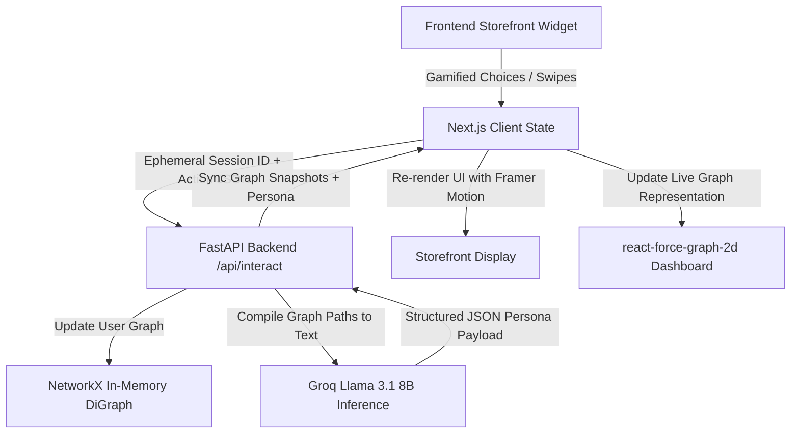

# TraitTrace

A privacy-first, cookie-less AdTech/MarTech personalization engine. Built for Epsilon's TeXpedition Hackathon.

TraitTrace dynamically profiles users' aesthetic and purchasing preferences in real-time, completely client-side and ephemeral. It captures zero-party data via gamified swipe/selection storefront widgets, maps these choices into an in-memory session knowledge graph, and uses a fast, free LLM (Llama 3.1 8B via Groq) to serve hyper-personalized copywriting and recommended banners.

## Technical Architecture



## Features

- **Gamified Storefront Widgets**: Swipeable aesthetic/pricing preference cards utilizing Framer Motion.
- **In-Memory NetworkX Knowledge Graph**: Tracks session-specific trait relationships dynamically.
- **Instant Groq LLM Inference**: Generates customized copywriting on-the-fly (`llama-3.1-8b-instant`).
- **Live Graph Dashboard**: Interactive 2D visualization of the active user profile path using `react-force-graph-2d`.
- **Zero-Party / Privacy First**: Works entirely on session state (UUIDs) without tracking cookies or persistent DB storage.

## Getting Started

### Prerequisites

- Python 3.10+
- Node.js 18+
- A free Groq API key from [Groq Console](https://console.groq.com/)

### Setup

1. **Clone & Set Environment Variables**
   Create a `.env` file at the project root:
   ```env
   GROQ_API_KEY=your_groq_api_key_here
   ```

2. **Run Backend**
   ```bash
   cd backend
   python -m venv venv
   # Windows:
   venv\Scripts\activate
   # Linux/macOS:
   source venv/bin/activate

   pip install -r ../requirements.txt
   uvicorn main:app --reload --port 8000
   ```

3. **Run Frontend**
   ```bash
   cd frontend
   npm install
   npm run dev
   ```
   The application will boot at `http://localhost:3000`.

## Testing

Run tests on the backend to verify the path compilation, JSON response sanitizing, and resiliency fallbacks:
```bash
pytest
```
